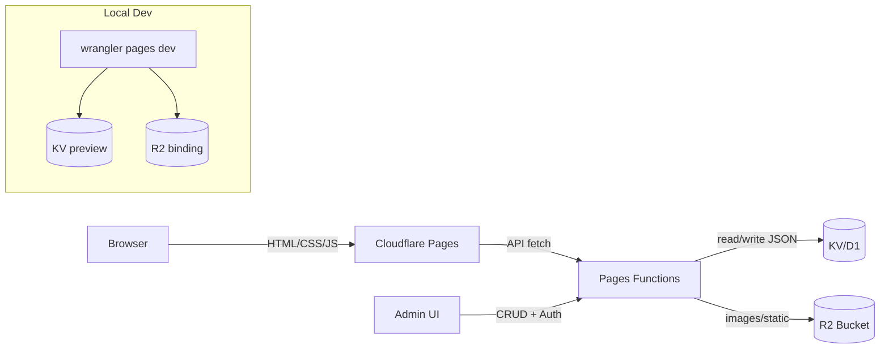

# Cloudflare Pages + Functions + KV/R2 배포 가이드 (HTML/CSS/JS)

## 아키텍처



## 디렉터리와 역할

- `public/`: 정적 HTML/CSS/JS, 작은 아이콘·폰트, 관리자 UI(`admin.html`) 포함. Pages가 그대로 서빙.
- 데이터 JSON: KV(또는 D1)에 저장. 기존 `assets/data/**`는 시드 소스.
- 이미지/대용량 정적: R2로 이동 후 JSON에 R2 URL을 저장.
- `functions/`: Pages Functions. 공개 조회 API(`functions/api/data.js` 등)와 관리자 CRUD API(`functions/api/admin.js`)가 KV/R2를 읽고 쓴다.
- `wrangler.toml`: KV/R2 바인딩, 환경변수, 사이트 버킷 설정. 예:

  ```toml
  name = "mbtitest-pages"
  compatibility_date = "2024-12-01"

  [site]
  bucket = "./public"

  [[kv_namespaces]]
  binding = "DB"
  id = "<prod-kv-id>"
  preview_id = "<preview-kv-id>"

  [[r2_buckets]]
  binding = "ASSETS"
  bucket_name = "mbti-assets"

  [vars]
  ASSETS_BASE = "https://<accountid>.r2.cloudflarestorage.com/mbti-assets"
  ADMIN_TOKEN = "change-me" # HMAC/Service Token/Access 사용 권장
  ```

## 데이터/관리 흐름

- 공개 조회: GET `/api/tests/:id` → KV에서 JSON 반환, `Cache-Control: public, max-age=60..300, stale-while-revalidate=600`, `ETag` 권장.
- 목록 조회: GET `/api/tests` → KV 키 프리픽스 스캔으로 index 반환.
- 관리자 CRUD: `/api/admin/tests` (POST/PUT/DELETE). Cloudflare Access, Service Token, 또는 `X-Admin-Token` HMAC 등으로 보호. 응답 시 버전/업데이트 시간 반환.
- 캐시 무효화: 관리자 쓰기 시 공개 응답을 `no-store`로 하고, 필요시 짧은 TTL로 자동 갱신되도록 둔다.
- 이미지 참조: JSON에는 R2 퍼블릭/사인드 URL을 저장하고, 프런트는 해당 URL을 직접 로드.

## 로컬 개발 흐름

1) 준비: `npm install -D wrangler` (또는 글로벌).
2) 미리보기: `wrangler pages dev public` → KV/R2 바인딩을 preview_id와 함께 사용.
3) KV 시드(예시):
   - 단건: `wrangler kv:key put --binding=DB tests:index "$(cat assets/data/index.json)"`
   - 벌크: `wrangler kv:bulk put --binding=DB seeds/bulk.jsonl`
4) R2가 퍼블릭이면 `ASSETS_BASE`로 직접 요청, 비공개면 Functions 경유.
5) 관리자 UI 테스트: `public/admin.html`에서 API 호출이 preview 바인딩을 타는지 확인.

## Cloudflare 설정 절차

1) KV 네임스페이스 생성: prod/preview 각각 생성 후 wrangler.toml에 id/preview_id 설정.
2) R2 버킷 생성: 이름 예 `mbti-assets`, 필요시 CORS(`*`, GET/HEAD, Content-Type/Range).
3) Pages 프로젝트 생성: Git 연결 → Build command 비움(정적) → Output dir `public`.
4) Pages Functions 활성화: `functions/` 자동 감지.
5) 바인딩: Functions 설정에서 `DB`(KV), `ASSETS`(R2) 추가, `ASSETS_BASE`/`ADMIN_TOKEN` 등 환경변수 설정.
6) 인증: 관리자 API에 Cloudflare Access 정책 또는 서비스 토큰 적용.
7) 도메인: 커스텀 도메인 연결 후 HTTPS 활성화.

## 배포 & 업로드 플로우

- 데이터(JSON) 업로드: `wrangler kv:bulk put --binding=DB seeds/bulk.jsonl` 또는 단건 `kv:key put`.
- 이미지 업로드: `wrangler r2 object put mbti-assets/path/to/file --file ./local/path` 또는 `wrangler r2 object sync ./localdir r2://mbti-assets`.
- 코드/정적 배포: Git push → Pages 자동 빌드/배포. 수동은 `wrangler pages publish public`.
- 캐시: API는 짧은 TTL+ETag, 관리자 응답은 `no-store`. 이미지/R2는 CDN 캐시가 필요할 때 Functions에서 헤더 설정.
- 롤백: Pages에서 이전 배포로 롤백 가능.

## 데이터 시드/이관 팁

- 키 설계 예: `tests/index`(목록), `tests/{id}`(본문), `tests/{id}/meta`(메타).
- 기존 `assets/data/**`를 JSONL로 변환해 `kv:bulk put`으로 적재.
- R2 이미지는 JSON의 URL을 업데이트 후 KV에 함께 저장.

## 체크리스트

- [ ] KV 바인딩(`DB`)과 R2 바인딩(`ASSETS`), `ASSETS_BASE`/`ADMIN_TOKEN`이 설정되었는가.
- [ ] 데이터(JSON)가 KV에 적재되고 공개 API(`/api/tests/:id`, `/api/tests`)가 캐시/헤더 포함 정상 동작하는가.
- [ ] 관리자 API가 인증/인가 후 KV에 쓰기/삭제를 수행하는가.
- [ ] R2 이미지가 올바른 URL로 응답하며 필요한 경우 CDN 캐시 정책이 적용되었는가.
- [ ] Pages Output dir이 `public`이며 로컬/프리뷰(`wrangler pages dev`)에서도 동일하게 동작하는가.
- [ ] 실도메인에서 API/이미지/관리자 UI 동작을 확인했는가.
