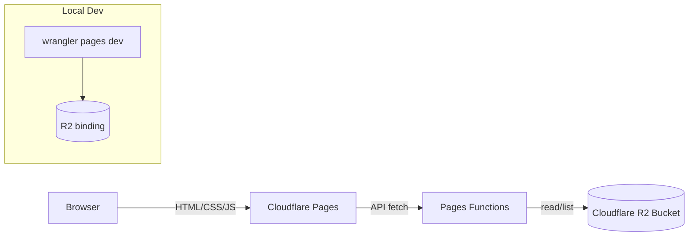

# Cloudflare Pages + R2 배포 가이드 (HTML/CSS/JS)

## 아키텍처


## 디렉터리와 역할
- `public/`: 정적 HTML/CSS/JS, 작은 아이콘/폰트만 유지. Pages가 그대로 서빙.
- R2로 옮길 것: 대용량 JSON·이미지(`public/assets/data/**` 등). 업로드 후 프런트/Functions가 R2 경로 사용.
- `functions/`: Pages Functions. 예: `functions/api/data.js`에서 R2 객체 읽어 JSON 반환.
- `wrangler.toml`: R2 바인딩, 환경변수, 사이트 버킷 설정. 예:
  ```toml
  name = "mbtitest-pages"
  compatibility_date = "2024-12-01"

  [site]
  bucket = "./public"

  [[r2_buckets]]
  binding = "ASSETS"
  bucket_name = "mbti-assets"

  [vars]
  ASSETS_BASE = "https://<accountid>.r2.cloudflarestorage.com/mbti-assets"
  ```

## 로컬 개발 흐름
1) 준비: `npm install -g wrangler` (또는 프로젝트 로컬 devDeps).
2) 정적 미리보기만 필요할 때: `wrangler pages dev public` (또는 `npx serve public`).
3) Functions + R2 바인딩 포함 미리보기: `wrangler pages dev public` 실행 시 `wrangler.toml`의 R2 바인딩을 사용. 필요하면 `.env`에 `ASSETS_BASE` 등 추가 후 wrangler가 주입.
4) 로컬 R2 대체: 퍼블릭 버킷이면 `ASSETS_BASE`로 직접 접근. 비공개라면 Functions 경유로만 테스트.

## Cloudflare 설정 절차
1) R2 버킷 생성: 이름 예 `mbti-assets`.
2) 접근 키 발급: R2 Access/Secret Key 생성.
3) CORS(퍼블릭 시): Origin `*`, Methods `GET, HEAD`, Headers `Content-Type, Range`.
4) Pages 프로젝트 생성: Git 연결 → Build command 비움(정적) → Output dir `public`.
5) Pages Functions 켜기: `functions/` 디렉터리 자동 감지.
6) 바인딩: Pages Settings → Functions → R2 Bindings에서 `ASSETS` = `mbti-assets` 추가. 필요한 환경변수(`ASSETS_BASE`, 기타 키)도 추가.
7) 도메인: 커스텀 도메인 연결 후 HTTPS 활성화.

## 배포 & 업로드 플로우
- 데이터/이미지 업로드: `wrangler r2 object put mbti-assets/path/to/file --file ./local/path` 또는 대량은 `wrangler r2 object sync ./localdir r2://mbti-assets`.
- 코드/정적 배포: Git push → Pages 자동 빌드/배포. 수동은 `wrangler pages publish public`.
- 캐시: R2 기본 캐시는 없음. CDN 캐시가 필요하면 Functions 응답 헤더에 `Cache-Control` 설정.
- 롤백: Pages에서 이전 배포로 롤백 가능.

## 체크리스트
- [ ] 대용량 JSON·이미지가 R2로 이동했고 올바른 경로로 접근하는가.
- [ ] `wrangler.toml`의 `r2_buckets` 바인딩과 `ASSETS_BASE`가 설정되었는가.
- [ ] Pages 프로젝트 Output dir이 `public`으로 설정되었는가.
- [ ] Functions가 R2를 정상 읽고(권한/CORS), 로컬 `wrangler pages dev`에서도 동작하는가.
- [ ] 배포 후 실도메인에서 API/이미지 응답을 확인했는가.

