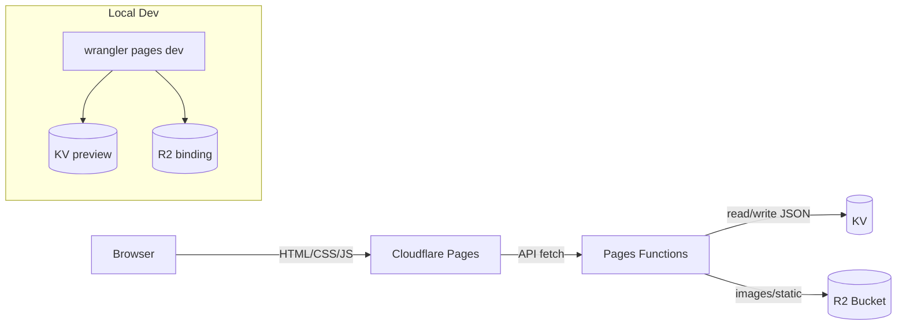

# Cloudflare Pages + Functions + KV/R2 가이드 (정적 프런트 + 공개 조회)

## 아키텍처



## 구성

- `public/`: 정적 HTML/CSS/JS.
- JSON: KV 저장(`tests/index`, `tests/{id}` 등), 기존 `assets/data/**`는 시드 원본.
- 이미지: R2 저장, JSON에는 R2 퍼블릭 URL을 기록.
- `functions/`: 공개 조회 API(`/api/tests`, `/api/tests/:id`)가 KV/R2를 사용.
- `wrangler.toml`: KV/R2 바인딩, 환경변수, 사이트 버킷 정의.

## wrangler.toml 예시

```toml
name = "mbtitest-pages"
compatibility_date = "2024-12-01"

[site]
bucket = "./public"

[[kv_namespaces]]
binding = "DB"
id = "<prod-kv-id>"
preview_id = "<preview-kv-id>"

[[r2_buckets]]
binding = "MBTI_BUCKET" # 또는 ASSETS
bucket_name = "mbti-assets"

[vars]
ASSETS_BASE = "https://<accountid>.r2.cloudflarestorage.com/mbti-assets/assets/data"
```

## 설정 절차

1. KV 네임스페이스(prod/preview) 생성 후 `binding=DB`로 wrangler.toml에 추가.
2. R2 버킷(`mbti-assets`) 생성 후 필요 시 CORS(GET/HEAD, Content-Type/Range) 허용.
3. `[site] bucket="./public"`, `[[r2_buckets]]`(`MBTI_BUCKET`), `[vars]`(`ASSETS_BASE`) 설정.

## 데이터 배치/마이그레이션

- 키 설계 예: `tests/index`(목록), `tests/{id}`(본문), `tests/{id}/meta`(메타).
- JSON → KV: `wrangler kv:bulk put --binding=DB seeds/bulk.jsonl` 또는 `wrangler kv:key put --binding=DB tests/index "$(cat assets/data/index.json)"`.
- 이미지 → R2: `wrangler r2 object sync ./public/assets/data r2://mbti-assets/assets/data` (단건은 `object put`).
- JSON에는 R2 퍼블릭 URL(`ASSETS_BASE/...`)을 저장해 프런트가 직접 로드.

## 프런트 로직 변경 (쿼리 → 경로)

- 기존: `/?testID=test-summer` 쿼리로 테스트 선택.
- 변경: 경로 기반으로 선택 후 쿼리 fallback 예시

  ```js
  const pathId = location.pathname.split("/").filter(Boolean).pop();
  const queryId = new URLSearchParams(location.search).get("testID");
  const testId = pathId || queryId;
  fetch("/api/tests/" + testId);
  ```

- 단일 진입점(`index.html`)을 유지한다면, Pages redirect or `_routes`로 `/tests/{id}` 같은 경로를 `index.html`로 리라이트하도록 설정.

## 로컬 개발

- `npm i -D wrangler`
- `wrangler pages dev public` (preview 바인딩 사용).
- `curl http://localhost:8788/api/tests` 등으로 KV 응답 확인, 이미지 URL이 R2에서 열리는지 확인.

## API 동작 가이드

- 공개 조회: GET `/api/tests`, `/api/tests/:id` → KV 읽기. 헤더 예: `Cache-Control: public, max-age=60..300, stale-while-revalidate=600`, `ETag` 권장.
- 이미지: 프런트는 응답 JSON의 R2 URL을 직접 사용.

## 배포 & 체크리스트

- Pages: Build command 없음(정적), Output dir `public`, Functions 자동 감지(`functions/`).
- 시드 후 검증: `/api/tests` 목록, `/api/tests/:id` 단건, 이미지 링크 확인.
- 변수/바인딩 확인: `DB`, `MBTI_BUCKET`(또는 `ASSETS`), `ASSETS_BASE`.
- 커스텀 도메인 연결 후 HTTPS 적용 여부 확인.
