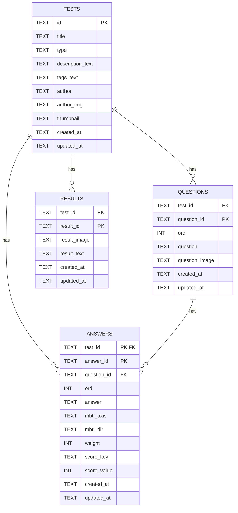

# ERD (D1 / SQLite)

이 문서는 현재 프로젝트의 Cloudflare **D1 (SQLite)** 스키마를 기준으로 작성되었습니다.  
이미지 파일은 R2에 저장하고, D1에는 **R2 object key(경로 문자열)** 만 저장합니다.

---

## 전체 관계(요약)

---

## 테이블 상세

## `tests`

- **역할**: 테스트(퀴즈) 단위의 메타데이터
- **PK**: `id`
- **주요 컬럼**
  - **`type`**: 평가 방식 구분 (예: `mbti`, `score`, `generic`)
  - **`description_text`**: 소개 문구(문자열). 줄바꿈은 `\n` 기반
  - **`tags_text`**: 태그(문자열). CSV-quote 기반
  - **`author_img`, `thumbnail`**: R2 object key (예: `assets/<testId>/images/thumbnail.png`)

## `questions`

- **역할**: 테스트의 문항
- **PK**: `(test_id, question_id)`
- **FK**
  - `test_id → tests.id` (ON DELETE CASCADE)
- **주요 컬럼**
  - **`ord`**: 문항 순서
  - **`question`**: 질문 텍스트
  - **`question_image`**: 질문 이미지 R2 key

## `answers`

- **역할**: 문항의 선택지(N개)
- **PK**: `(test_id, answer_id)`
- **FK**
  - `(test_id) → tests.id` (ON DELETE CASCADE)
  - `(test_id, question_id) → questions(test_id, question_id)` (ON DELETE CASCADE)
- **주요 컬럼**
  - **`ord`**: 선택지 순서
  - **`answer`**: 선택지 텍스트
  - **MBTI 입력(디자이너 친화형)**
    - **`mbti_axis`**: `EI | SN | TF | JP`
    - **`mbti_dir`**: `plus | minus` (더하기/빼기)
    - **`weight`**: 더/빼는 수치(양수)
  - **Score 테스트 입력(디자이너 친화형)**
    - **`score_key`**: 점수를 줄 결과 키(예: `A`, `summer`)
    - **`score_value`**: 더할 점수(정수)

## `results`

- **역할**: 결과(페이지) 데이터
- **PK**: `(test_id, result_id)`
- **FK**
  - `test_id → tests.id` (ON DELETE CASCADE)
- **주요 컬럼**
  - **`result_id`**: 결과 코드(예: MBTI라면 `ENFP`)
  - **`result_image`**: 결과 이미지 R2 key
  - **`result_text`**: 결과 설명 텍스트

---

## 인덱스

스키마(`migrations/0001_init.sql`)에 포함된 기본 인덱스:

- `idx_questions_test_ord` on `questions(test_id, ord)`
- `idx_answers_test_question_ord` on `answers(test_id, question_id, ord)`
- `idx_results_test_result_id` on `results(test_id, result_id)`
