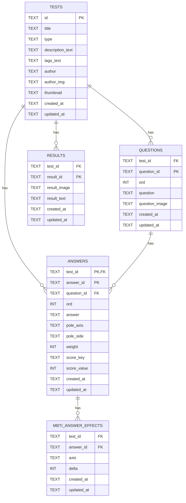

# ERD (D1 / SQLite)

이 문서는 현재 프로젝트의 Cloudflare **D1 (SQLite)** 스키마를 기준으로 작성되었습니다.  
이미지 파일은 R2에 저장하고, D1에는 **R2 object key(경로 문자열)** 만 저장합니다.

---

## 전체 관계(요약)

---

## 테이블 상세

## `tests`

- **역할**: 테스트(퀴즈) 단위의 메타데이터
- **PK**: `id`
- **주요 컬럼**
  - **`type`**: 평가 방식 구분 (예: `mbti`, `score`, `generic`)
  - **`description_text`**: 소개 문구(문자열). 줄바꿈은 `\n` 기반
  - **`tags_text`**: 태그(문자열). CSV-quote 기반
  - **`author_img`, `thumbnail`**: R2 object key (예: `assets/<testId>/images/thumbnail.png`)

## `questions`

- **역할**: 테스트의 문항
- **PK**: `(test_id, question_id)`
- **FK**
  - `test_id → tests.id` (ON DELETE CASCADE)
- **주요 컬럼**
  - **`ord`**: 문항 순서
  - **`question`**: 질문 텍스트
  - **`question_image`**: 질문 이미지 R2 key

## `answers`

- **역할**: 문항의 선택지(N개)
- **PK**: `(test_id, answer_id)`
- **FK**
  - `(test_id) → tests.id` (ON DELETE CASCADE)
  - `(test_id, question_id) → questions(test_id, question_id)` (ON DELETE CASCADE)
- **주요 컬럼**
  - **`ord`**: 선택지 순서
  - **`answer`**: 선택지 텍스트
  - **Pole 입력(디자이너 친화형, 범용)**
    - **`pole_axis`**: pole(양극) “영역/축” 식별자 (예: `EI | SN | TF | JP` 또는 기타 축 ID)
    - **`pole_side`**: pole “세부 영역/편향” 식별자 (예: `E/I/S/N/T/F/J/P` 또는 기타 side ID)
    - **`weight`**: 점수 크기(양수). MBTI의 +/−는 `(pole_axis, pole_side)`로 부호를 유도합니다.
  - **Score 테스트 입력(디자이너 친화형)**
    - **`score_key`**: 점수를 줄 결과 키(예: `A`, `summer`)
    - **`score_value`**: 더할 점수(정수)

## `results`

- **역할**: 결과(페이지) 데이터
- **PK**: `(test_id, result_id)`
- **FK**
  - `test_id → tests.id` (ON DELETE CASCADE)
- **주요 컬럼**
  - **`result_id`**: 결과 코드(예: MBTI라면 `ENFP`)
  - **`result_image`**: 결과 이미지 R2 key
  - **`result_text`**: 결과 설명 텍스트

## `mbti_answer_effects`

- **역할**: MBTI 결과 계산을 “DB 집계 1번”으로 끝내기 위한 최적화 테이블
- **PK**: `(test_id, answer_id)`
- **FK**
  - `(test_id, answer_id) → answers(test_id, answer_id)` (ON DELETE CASCADE)
- **주요 컬럼**
  - **`axis`**: `EI | SN | TF | JP`
  - **`delta`**: 축에 더할 점수(부호 포함 정수)
    - 예: `EI`에서 `+2`면 E 쪽으로 2점, `-1`이면 I 쪽으로 1점

---

## assets JSON → D1 정규화 매핑(현재 repo 기준)

`assets/index.json`과 각 `assets/<testId>/test.json`을 아래 테이블로 정규화합니다.

- **`assets/index.json`**
  - `tests[].id` → `tests.id`
  - `tests[].title` → `tests.title` (fallback)
  - `tests[].thumbnail` → `tests.thumbnail` (fallback)
  - `tests[].tags[]` → `tests.tags_text` (encode)
  - `tests[].createdAt/updatedAt` → `tests.created_at/updated_at` (ISO로 변환)

- **`assets/<testId>/test.json`**
  - `id/title/type/description/tags/author/authorImg/thumbnail` → `tests.*`
  - `questions[].id/label/prompt` → `questions.(question_id, question, question_image)`
  - `questions[].answers[].id/label` → `answers.(answer_id, answer)`
  - `questions[].answers[].mbtiAxis + direction(+weight)` → `answers.(pole_axis, pole_side, weight)` 및 `mbti_answer_effects.(axis, delta)`
  - `results{ CODE: { image, summary } }` → `results.(result_id, result_image, result_text)`

---

## 인덱스

스키마(`migrations/0001_init.sql`)에 포함된 기본 인덱스:

- `idx_questions_test_ord` on `questions(test_id, ord)`
- `idx_answers_test_question_ord` on `answers(test_id, question_id, ord)`
- `idx_results_test_result_id` on `results(test_id, result_id)`
- `idx_mbti_effects_test_axis` on `mbti_answer_effects(test_id, axis)` (migration `0006`)
